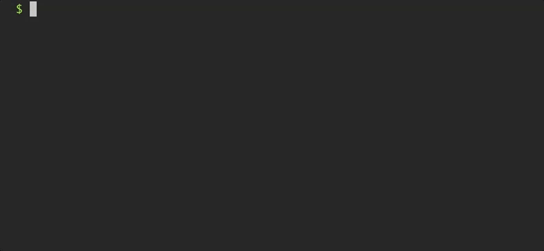

# Github Release Notes

[](https://badge.fury.io/js/github-release-notes)
[](http://standardjs.com)
[](https://travis-ci.org/github-tools/github-release-notes)
[](https://gitter.im/github-release-notes/Lobby?utm_source=badge&utm_medium=badge&utm_campaign=pr-badge&utm_content=badge)

> Node module that generates release notes based on commit messages or closed issues between tags. It also can create a full changelog or add the latest release notes to the existing changelog file.

If you want to include it in a task, you can use [grunt-github-release-notes](https://github.com/github-tools/grunt-github-release-notes)

## Installation

Install `github-release-notes` via npm:

```shell
npm install github-release-notes -g
```

## Setup

First generate a `github token` at [this link](https://help.github.com/articles/creating-an-access-token-for-command-line-use/). _You only need "repo" scope._
Then add this to  `~/.bash_profile` or `~/.zshrc`):

```shell
export GREN_GITHUB_TOKEN=your_token_here
```

## Basic Usage

```shell
# Navigate to your project directory
cd ~/Path/to/repo
# Run the task
gren
```

Otherwise, you can run it anywhere passing the repo information:

```shell
gren --username=[username] --repo=[repo name]
```

To use a specific token you can specify it as option:

```shell
gren --token=[your token]
```

### Demo



### Actions

**Gren** has two main usages: `release` and `changelog`.
You can select the action with the `--action` option.

[See full documentation here](https://github-tools.github.io/github-release-notes)
